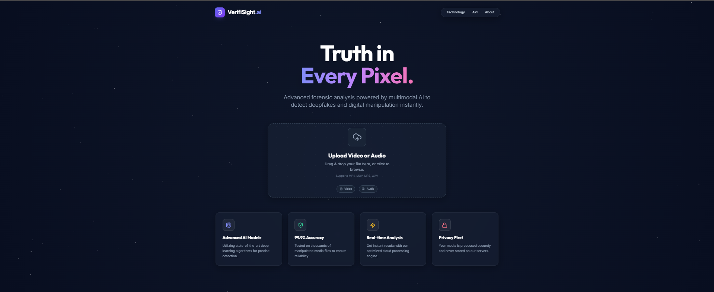

<div align="center">

# 🌈 Prism Studio

### The Ultimate AI Creative Suite

*Unleash your creativity with a powerhouse of AI tools in one beautiful workspace.*

[](https://deep-fake-audio-video-detector.vercel.app/)
[](https://reactjs.org/)
[](https://www.typescriptlang.org/)
[](https://ai.google.dev/)
[](https://tailwindcss.com/)



[🌐 View Live](https://deep-fake-audio-video-detector.vercel.app/) · [📝 Report Bug](https://github.com/yourusername/prism-studio/issues) · [✨ Request Feature](https://github.com/yourusername/prism-studio/issues)

</div>

---

## 📑 Table of Contents

- [Features](#-features)
- [How It Works](#-how-it-works)
- [Tech Stack](#-tech-stack)
- [Quick Start](#-quick-start)
- [Development](#-development)
- [Deployment](#-deployment)
- [Contributing](#-contributing)
- [License](#-license)

---

## 🎨 Features

Prism Studio is a comprehensive suite of AI-powered tools designed to enhance your productivity and creativity.

<table>
<tr>
<td width="50%">

### 🎨 **Creative Tools**
- **Image Generator**: Create stunning visuals from text prompts.
- **3D Motion**: Bring static images to life with 3D depth animations.
- **Magic Eraser**: Remove unwanted objects from photos seamlessly.
- **Background Remover**: Instant transparent backgrounds.
- **Image Upscaler**: Enhance image resolution without losing quality.
- **Image to PDF**: Convert your images into professional PDF documents.

</td>
<td width="50%">

### 🛡️ **Security & Analysis**
- **Deepfake Detector**: Advanced multimodal analysis to detect manipulated audio and video.
- **Live Guard**: Real-time protection against digital threats (*Coming Soon*).

### ⚡ **Productivity**
- **YouTube Summarizer**: Get concise notes and summaries from any YouTube video.
- **Document Summarizer**:  Quickly digest long documents.
- **Essay Writer**: Generate structured essays from images and prompts.
- **Text to Speech**: Convert text into natural-sounding speech.

</td>
</tr>
</table>

> [!NOTE]
> All tools are powered by state-of-the-art AI models, running continuously on optimized cloud infrastructure.

---

## 🏗️ Tech Stack

Built with the latest web technologies for performance and experience.

<div align="center">

| Core | Styles & UI | AI & ML | Build |
|------|-------------|---------|-------|
|  |  |  |  |
|  |  |  |  |
|  |  |  |  |

</div>

---

## 🚀 Quick Start

### Prerequisites

- **Node.js** (v18 or higher)
- **Google Gemini API Key** ([Get one here](https://makersuite.google.com/app/apikey))

### Installation

1. **Clone the repository**
   ```bash
   git clone https://github.com/yourusername/prism-studio.git
   cd prism-studio
   ```

2. **Install dependencies**
   ```bash
   npm install
   ```

3. **Configure Environment**
   Create a `.env.local` file in the root directory:
   ```env
   VITE_API_KEY=your_gemini_api_key_here
   ```

4. **Start Development Server**
   ```bash
   npm run dev
   ```

Visit `http://localhost:5173` to explore Prism Studio! 🎉

---

## 🛠️ Development

### Project Structure

```
prism-studio/
├── src/
│   ├── pages/               # Individual tools (Detector, ImageGen, etc.)
│   ├── components/          # Shared UI components (UploadZone, FloatingCard)
│   ├── services/            # API integrations (Gemini, etc.)
│   └── icons/               # Custom assets
├── public/                  # Static assets
└── ...config files
```

### Available Scripts

- `npm run dev`: Start the development environment.
- `npm run build`: specialized build for production.
- `npm run preview`: Preview the production build locally.

---

## 🚢 Deployment

**Prism Studio** is optimized for Vercel.

[](https://vercel.com/new/clone?repository-url=https://github.com/yourusername/prism-studio)

1. Fork this repo.
2. Connect to Vercel.
3. Add your `VITE_API_KEY` in Vercel project settings.
4. Deploy!

---

## 🤝 Contributing

We welcome contributions!

1. Fork the Project
2. Create your Feature Branch (`git checkout -b feature/AmazingFeature`)
3. Commit your Changes (`git commit -m 'Add some AmazingFeature'`)
4. Push to the Branch (`git push origin feature/AmazingFeature`)
5. Open a Pull Request

---

## 📄 License

Distributed under the MIT License. See `LICENSE` for more information.

---

## 🙏 Acknowledgments

- **Google Gemini** for the incredible multimodal AI capabilities.
- **Vercel** for hosting and analytics.
- **The Open Source Community** for the tools that make this possible.

---

<div align="center">

### Made with ❤️ by Alins Binu


</div>
<div align="center"><!-- Animated Header Banner -->🌈 The Ultimate AI Creative SuiteA powerhouse of intelligence and imagination, unified in one elegant workspace.🌐 View Live · 📝 Report Bug · ✨ Request Feature</div>📑 Table of Contents✨ Key Features🏗️ How It Works🛠️ Tech Stack🚀 Quick Start🤝 Contributing✨ Key FeaturesPrism Studio bridges the gap between creative expression and digital security.<table width="100%"><tr><td width="50%" valign="top">🎨 Creative ToolsImage Generator • Transform text into high-fidelity visuals.3D Motion • Animate static images with neural depth mapping.Magic Eraser • Clean up photos with AI-powered inpainting.Background Remover • Instant precision masking.Image Upscaler • 4k enhancement without quality loss.Image to PDF • Professional document synthesis.</td><td width="50%" valign="top">🛡️ Security & ProductivityDeepfake Detector • Multimodal analysis for video/audio forgery.Live Guard • Coming Soon - Real-time digital threat monitoring.YouTube Summarizer • Concise intelligence from long-form video.Essay Writer • Structured generation from visual & text prompts.Text to Speech • Natural, emotive vocal synthesis.</td></tr></table>🏗️ How It WorksPrism Studio utilizes a Multi-Agent Neural Pipeline to process your data.graph TD
    A[User Input/Upload] --> B{Prism Router}
    B -->|Creative Task| C[Gemini Image/Vision API]
    B -->|Security Task| D[TensorFlow.js Forgery Model]
    B -->|Language Task| E[Gemini 2.0 Text Engine]
    C --> F[Canvas Interaction Layer]
    D --> G[Probability Analysis Report]
    E --> H[Summarized / Generated Content]
    F & G & H --> I[Unified UI Response]
    
    style B fill:#6366f1,color:#fff
    style I fill:#10b981,color:#fff
🛠️ Tech Stack<div align="center">Core FrameworkIntelligenceStyling & MotionBuild ToolReact 19Gemini AIFramer MotionVite / Vercel</div>🚀 Quick Start1. Clone & Installgit clone [https://github.com/yourusername/prism-studio.git](https://github.com/yourusername/prism-studio.git)
cd prism-studio
npm install
2. Configure Brain (API)Create a .env.local in the root and add your Gemini API Key:VITE_API_KEY=your_gemini_api_key_here
3. Launch the Studionpm run dev
Visit http://localhost:5173 to start creating!🤝 ContributingWe believe in open-source innovation!Fork the Repo.Branch out (git checkout -b feature/AmazingFeature).Commit your changes (git commit -m 'Add some AmazingFeature').Push (git push origin feature/AmazingFeature).Open a Pull Request.<div align="center">Made with ❤️ by Alins Binu<!-- Animated Footer --></div>
