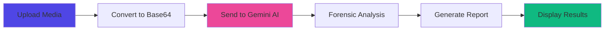

<div align="center">

# 🛡️ VerifiSight AI

### Truth in Every Pixel

*Advanced forensic analysis powered by multimodal AI to detect deepfakes and digital manipulation instantly*

[](https://deep-fake-audio-video-detector.vercel.app/)
[](https://reactjs.org/)
[](https://www.typescriptlang.org/)
[](https://ai.google.dev/)


[🌐 View Live](https://deep-fake-audio-video-detector.vercel.app/) · [📝 Report Bug](https://github.com/yourusername/verifisight-ai/issues) · [✨ Request Feature](https://github.com/yourusername/verifisight-ai/issues)

</div>

---

## ✨ Features

<table>
<tr>
<td width="50%">

### 🎯 **Advanced AI Detection**
Powered by Google's Gemini 2.5 Flash model for state-of-the-art multimodal analysis

### 🎥 **Multi-Format Support**
Analyze both video (MP4, MOV) and audio (MP3, WAV) files with ease

### ⚡ **Real-time Analysis**
Get instant results with optimized cloud processing

</td>
<td width="50%">

### 🔒 **Privacy First**
Your media is never stored on our servers - analyze with confidence

### 📊 **Detailed Reports**
Comprehensive analysis with confidence scores and AI reasoning

### 🎨 **Beautiful UI**
Modern, responsive design with smooth animations and glassmorphism effects

</td>
</tr>
</table>

---

## 🚀 Quick Start

### Prerequisites

- **Node.js** (v18 or higher)
- **npm** or **yarn**
- **Google Gemini API Key** ([Get one here](https://makersuite.google.com/app/apikey))

### Installation

```bash
# Clone the repository
git clone https://github.com/yourusername/verifisight-ai.git
cd verifisight-ai

# Install dependencies
npm install

# Create environment file
cp .env.local.example .env.local

# Add your Gemini API key to .env.local
echo "VITE_API_KEY=your_api_key_here" > .env.local

# Start the development server
npm run dev
```

Visit `http://localhost:5173` to see the app in action! 🎉

---

## 🏗️ Tech Stack

<div align="center">

| Frontend | AI/ML | Styling | Build Tools |
|----------|-------|---------|-------------|
|  |  |  |  |
|  |  |  |  |

</div>

---

## 📖 How It Works



**VerifiSight AI** uses advanced computer vision and audio processing techniques to:

1. **Visual Artifact Detection** - Identifies warping, blurring, inconsistent lighting, and face manipulation
2. **Audio Anomaly Detection** - Detects robotic tones, background noise mismatches, and lip-sync errors
3. **AI Signature Recognition** - Recognizes patterns typical of AI-generated content
4. **Confidence Scoring** - Provides a 0-100 score indicating authenticity likelihood

---

## 🎯 Usage

### Basic Analysis

1. **Upload** - Drag and drop or click to select your media file
2. **Wait** - The AI analyzes your content (usually takes 5-10 seconds)
3. **Review** - Check the verdict, confidence score, and detailed reasoning
4. **Repeat** - Click "Analyze Another File" to test more content

### Supported Formats

| Type | Formats |
|------|---------|
| **Video** | MP4, MOV, AVI, WebM |
| **Audio** | MP3, WAV, M4A, OGG |

---

## 🛠️ Development

### Project Structure

```
verifisight-ai/
├── components/           # React components
│   ├── BackgroundParticles.tsx
│   ├── Features.tsx
│   ├── FloatingCard.tsx
│   ├── ResultsCard.tsx
│   └── UploadZone.tsx
├── services/            # API services
│   └── geminiService.ts
├── App.tsx              # Main application
├── types.ts             # TypeScript definitions
├── index.css            # Global styles
└── vite.config.ts       # Vite configuration
```

### Available Scripts

```bash
npm run dev      # Start development server
npm run build    # Build for production
npm run preview  # Preview production build
```

### Environment Variables

Create a `.env.local` file in the root directory:

```env
VITE_API_KEY=your_gemini_api_key_here
```

---

## 🚢 Deployment

### Deploy to Vercel (Recommended)

[](https://vercel.com/new/clone?repository-url=https://github.com/yourusername/verifisight-ai)

1. Push your code to GitHub
2. Import your repository in Vercel
3. Add `VITE_API_KEY` environment variable
4. Deploy! 🚀

### Other Platforms

- **Netlify**: Follow similar steps as Vercel
- **Cloudflare Pages**: Connect your GitHub repo
- **AWS Amplify**: Use the Amplify Console

See [DEPLOY.md](DEPLOY.md) for detailed deployment instructions.

---

## 🤝 Contributing

Contributions are what make the open source community amazing! Any contributions you make are **greatly appreciated**.

1. Fork the Project
2. Create your Feature Branch (`git checkout -b feature/AmazingFeature`)
3. Commit your Changes (`git commit -m 'Add some AmazingFeature'`)
4. Push to the Branch (`git push origin feature/AmazingFeature`)
5. Open a Pull Request

---

## 📄 License

Distributed under the MIT License. See `LICENSE` for more information.

---

## 🙏 Acknowledgments

- [Google Gemini AI](https://ai.google.dev/) - Powering our deepfake detection
- [Tailwind CSS](https://tailwindcss.com/) - For beautiful styling
- [Framer Motion](https://www.framer.com/motion/) - For smooth animations
- [Lucide Icons](https://lucide.dev/) - For gorgeous icons
- [Vercel](https://vercel.com/) - For seamless deployment

---

## 📞 Contact

**Project Link**: [https://github.com/yourusername/verifisight-ai](https://github.com/yourusername/verifisight-ai)

**Live Demo**: [https://deep-fake-audio-video-detector.vercel.app/](https://deep-fake-audio-video-detector.vercel.app/)

---

<div align="center">

### ⭐ Star this repo if you find it useful!

**Made with ❤️ and AI**


</div>
<!-- Force Redeploy -->
