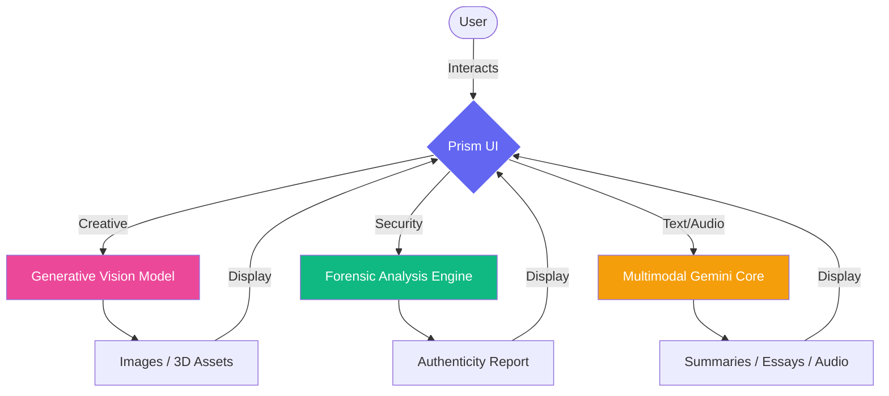

<div align="center">

<!-- Animated Header -->


<!-- Typing Effect -->
<a href="https://git.io/typing-svg"></a>

<br/>

<!-- Badges -->
[](https://opensource.org/licenses/MIT)
[](https://reactjs.org/)
[](https://www.typescriptlang.org/)
[](https://tailwindcss.com/)
[](https://vercel.com/)

<br/>

### *Where Imagination Meets Intelligence*

[](prism_landing.png)

[🌐 Live Demo](https://deep-fake-audio-video-detector.vercel.app/) · [📝 Report Bug](https://github.com/yourusername/prism-studio/issues) · [✨ Request Feature](https://github.com/yourusername/prism-studio/issues)

</div>

<br/>

---

<div align="center">

</div>

## 📑 Table of Contents

- [✨ Features](#-features)
- [🏗️ How It Works](#-%EF%B8%8F-how-it-works)
- [🛠️ Tech Stack](#-%EF%B8%8F-tech-stack)
- [🚀 Quick Start](#-quick-start)
- [💻 Development](#-development)
- [🤝 Contributing](#-contributing)
- [📜 License](#-license)

---

## ✨ Features

Experience a unified workspace consisting of three powerful pillars.

<table>
<tr>
<td width="50%" valign="top">

### 🎨 **Creative Studio**
> *Transform ideas into reality.*

- **Image Generator** 🖌️
  - Create high-fidelity visuals from text prompts.
- **3D Motion** 🌀
  - Add depth and movement to static images.
- **Magic Eraser** 🪄
  - Seamlessly remove unwanted objects.
- **Background Remover** ✂️
  - Instant precision cutout and transparency.
- **Image Upscaler** 🔍
  - Enhanced resolution up to 4x.
- **Image to PDF** 📄
  - Professional document conversion.

</td>
<td width="50%" valign="top">

### 🛡️ **Security & Intelligence**
> *Protect and uphold the truth.*

- **Deepfake Detector** 🕵️‍♂️
  - Multimodal analysis (Audio & Video) to detect manipulation.
  - Granular confidence scoring.
- **Live Guard** 🛡️ (*Coming Soon*)
  - Real-time digital threat monitoring.

### ⚡ **Productivity Hub**
> *Work smarter, not harder.*

- **YouTube Summarizer** 📺
  - Extract detailed notes from long videos instantly.
- **Document Summarizer** 📚
  - Digest complex PDFs in seconds.
- **Essay Writer** ✍️
  - Structured content generation from prompts.
- **Text to Speech** 🗣️
  - Lifelike vocal synthesis and narration.

</td>
</tr>
</table>

---

## 🏗️ How It Works

Prism Studio routes your requests through specialized AI agents.



---

## 🛠️ Tech Stack

We use the best tools to ensure speed, scalability, and beauty.

<div align="center">

[](https://skillicons.dev)

</div>

---

## 🚀 Quick Start

### Prerequisites

- **Node.js** (v18+)
- **Google Gemini API Key** ([Get Key](https://makersuite.google.com/app/apikey))

### ⚡ Installation

1. **Clone & Enter**
   ```bash
   git clone https://github.com/yourusername/prism-studio.git
   cd prism-studio
   ```

2. **Install Dependencies**
   ```bash
   npm install
   ```

3. **Set Up Brain**
   Create a `.env.local` file:
   ```env
   VITE_API_KEY=your_gemini_api_key_here
   ```

4. **Launch**
   ```bash
   npm run dev
   ```

   Visit `http://localhost:5173` 🚀

---

## 💻 Development

### 📂 Structure

```bash
prism-studio/
├── 📂 src/
│   ├── 📂 pages/          # The Toolset (Detector, Generators...)
│   ├── 📂 components/     # UI Building Blocks
│   ├── 📂 services/       # AI Integration Layer
│   └── 📂 icons/          # Visual Assets
├── 📂 public/             # Static Files
└── 📄 package.json        # Dependencies
```

---

## 🤝 Contributing

Contributions make the open-source community an amazing place to learn, inspire, and create. Any contributions you make are **greatly appreciated**.

1. Fork the Project
2. Create your Feature Branch (`git checkout -b feature/AmazingFeature`)
3. Commit your Changes (`git commit -m 'Add some AmazingFeature'`)
4. Push to the Branch (`git push origin feature/AmazingFeature`)
5. Open a Pull Request

---

## 📜 License

Distributed under the MIT License. See `LICENSE` for more information.

---

## 🙏 Acknowledgments

<div align="center">
  
  
</div>

<br/>

<div align="center">

### Made with ❤️ by Alins Binu


</div>
